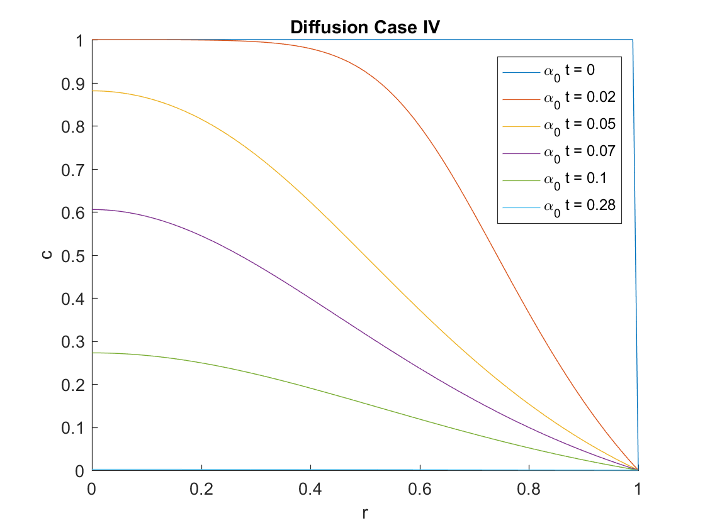

# FD_spheres_variable_diffusivity
Finite difference discretization scheme for diffusion in a sphere with variable diffusivity

## Overview
This code solves the PDE for Fickian diffusion with variable diffusivity within a radially symmetric sphere. The PDE is solved numerically using method of lines, the spherical finite difference discretization scheme defined and analyzed in the reference, and any built-in MATLAB ODE solver. Examples are provided for variable diffusivity cases I-IV presented in the reference listed below. The use of ode45 solver is shown in this code. Any ODE solver could be selected.

## Finite Difference Discretization Scheme for Spherical Diffusion with Variable Diffusivity
### Authors
Ashlee N. Ford Versypt 
School of Chemical Engineering, Oklahoma State University
ashleefv@okstate.edu

Richard D. Braatz
Department of Chemical Engineering, Massachusetts Institute of Technology
braatz@mit.edu

## Reference
A. N. Ford Versypt & R. D. Braatz, Analysis of finite difference discretization schemes for diffusion in spheres with variable diffusivity, Computers & Chemical Engineering, 71 (2014) 241-252, https://doi.org/10.1016/j.compchemeng.2014.05.022

## Diffusivity cases (defined computationally in FD_spheres_variable_diffusivity.m)
DCASE = 1; 
Case I: constant diffusivity with alpha = alpha0

DCASE = 2;
Case II: time-dependent diffusivity
alpha = alpha0 for t =< tau
and
alpha = alpha0*exp(k*(t - tau)) for t > tau

DCASE = 3;
Case III: spatially dependent diffusivity
alpha = alpha0*r^2

DCASE = 4;
CASE IV: concentration-dependent diffusivity
alpha = alpha0*exp(k-k*c)

## Code
solve_FD_spheres_variable_diffusivity.m solves the diffusion PDE in spherical coordinates for c(r,t) with variable diffusivity defined by DCASE

FD_spheres_variable_diffusivity uses the finite difference discretization scheme defined in the reference as Scheme 1 and the variable diffusivity Cases I-IV analyzed in that work.
